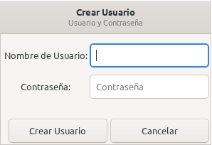
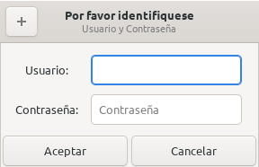
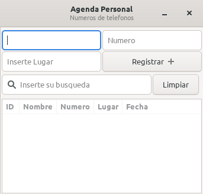

# Agenda_Personal

Agenda para registro de telefonos en Lua GTK y Sqlite3

# Release v1.0

- [x] keyval integrado (entrar al main_window al presionar la tecla return)
- [x] añadido modulo de registro de usuario
- [x] añadido el makefile
- [x] añadido el submodulo de lgi

## Todo
- [x] keyval hablitilado en modulo de registro de usuarios
- [x] dialogo de ayuda
- [x] tray icon
- [ ] notificaciones en tray icon
- [ ] boton limpiar implementado
- [ ] buscador de contactos implementado
- [ ] añadido el submodulo de sqlite3 

## Screenshot

 

 

 

## Dependencias

- [sqlite3](https://www.sqlite.org/download.html)
- [lua-lgi](https://github.com/pavouk/lgi/)

### Instalacion
`make db && make install`

#### Contactos

Gmail: sodomon2@gmail.com
